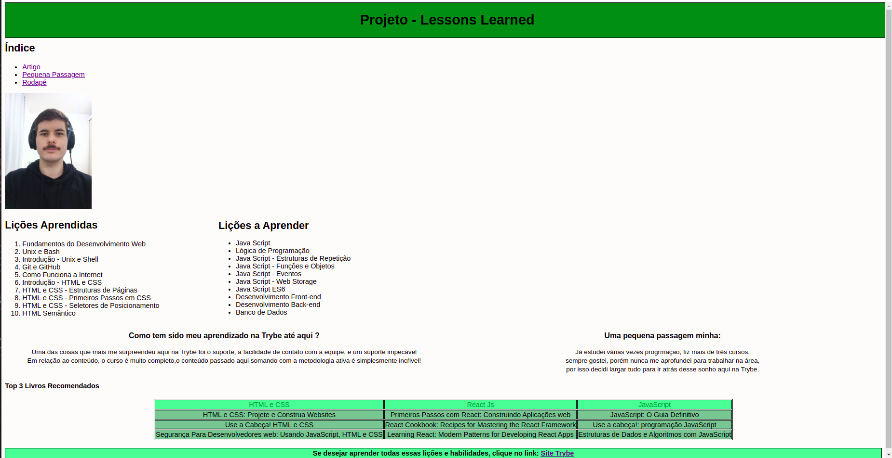

# Boas-vindas ao repositório Projeto Lessons Learned! ✌️
  
O primeiro projeto realizado aqui na <a href="https://github.com/betrybe">Trybe</a>.

## 🌍 Sobre o Projeto:
  
Esse projeto tinha como objetivo fazer uma página usando HTML e CSS, usando conceitos como o "box model" no css para posicionar os elementos na página e
  tags semânticas em html, o resultado final pode ser visto na imagem a seguir:
  

</img>;

 ##  [Link do Projeto no GitHub Pages](https://jeancarlos-sc.github.io/Projeto-Lessons-Learned/)
